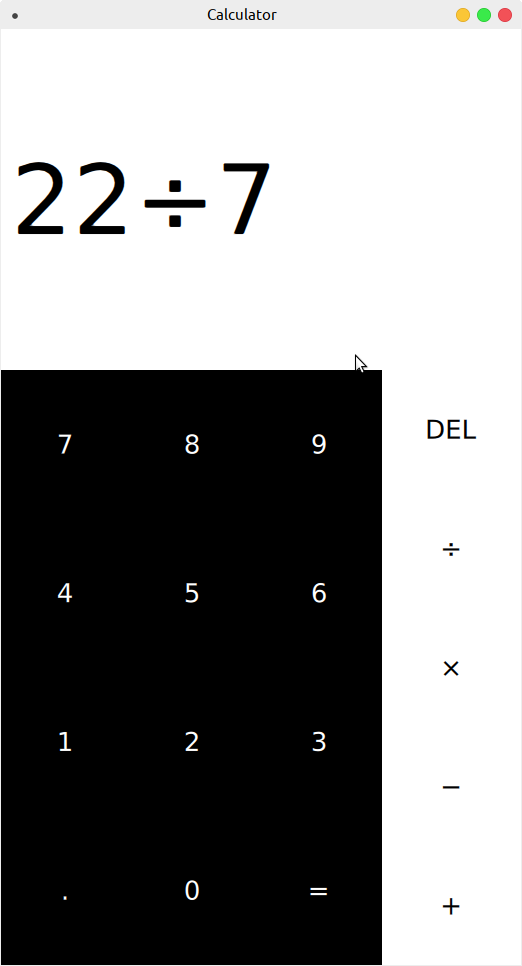

# Calculator

A primitive touch based calculator written for the reMarkable tablet.
The design and functionality are primarily based on the stock Android
Material design calculator found on most Android 5.0+ devices

At the current state, even for a primitive calculator it is still
lacking a great amount of features that will be implemented in the future.

Additionally, the paper white display suffers from great latency, which may
make the experience seem bothersome to some users.

## Build

The calculator can be build for both [reMarkable](http://remarkablewiki.com/index.php?title=Setting_up_Qt_Creator) and desktop. However,
as it has primarily been written with the reMarkable in mind, visual looks may look odd.

In the upcoming future it is planned to seperate both platforms with a branch each

### reMarkable
The project file under this repository was saved in such a way, that no modification is required to compile it for the reMarkable, that is assuming that the user has created and selected a kit for the reMarkable. If not, then please do so with the help of [this guide](http://remarkablewiki.com/index.php?title=Setting_up_Qt_Creator)

Simply import this project in your Qt Creator IDE and run the application with your reMarkable kit.

### Desktop
The build the calculator for your desktop, import the project in your Qt Creator IDE and open the project file. From there, uncomment [this line](https://github.com/reHackable/Calculator/blob/master/Calculator.pro#L7) and comment [this line](https://github.com/reHackable/Calculator/blob/master/Calculator.pro#L10).

With this being set, you may compile and execute the application on your desktop system.

## Tips

Some tips that should be noted:

- To delete the entire calculation, simply **hold** the 'DEL' button
- Decimals are floored at 12th decimal
- A cursor can be placed and positioned to remove delete

